# E-commerce Customer Support Workflow

**Intelligent multi-agent Flowise workflow for comprehensive e-commerce customer support**

Automatically routes customer inquiries to 8 specialized agents covering orders, returns, products, payments, shipping, accounts, promotions, and general help.

---

## 📊 Workflow Architecture

**[View Full Workflow Diagram →](./WORKFLOW-DIAGRAM.md)**

```mermaid
%%{init: {'theme':'base', 'themeVariables': { 'primaryColor':'#4DD0E1','primaryTextColor':'#000','primaryBorderColor':'#0097A7','lineColor':'#757575','secondaryColor':'#ff8fab','tertiaryColor':'#7EE787'}}}%%
graph TD
    startAgentflow_0([🚀 Start])
    style startAgentflow_0 fill:#7EE787,stroke:#333,stroke-width:2px
    conditionAgentAgentflow_0{{🎯 Detect User Intention}}
    style conditionAgentAgentflow_0 fill:#ff8fab,stroke:#333,stroke-width:2px
    agentAgentflow_1[🤖 Agent.OrderTracking]
    style agentAgentflow_1 fill:#4DD0E1,stroke:#333,stroke-width:2px
    agentAgentflow_2[🤖 Agent.Returns]
    style agentAgentflow_2 fill:#4DD0E1,stroke:#333,stroke-width:2px
    agentAgentflow_3[🤖 Agent.ProductInfo]
    style agentAgentflow_3 fill:#4DD0E1,stroke:#333,stroke-width:2px
    agentAgentflow_4[🤖 Agent.Payment]
    style agentAgentflow_4 fill:#4DD0E1,stroke:#333,stroke-width:2px
    agentAgentflow_5[🤖 Agent.Shipping]
    style agentAgentflow_5 fill:#4DD0E1,stroke:#333,stroke-width:2px
    agentAgentflow_6[🤖 Agent.Account]
    style agentAgentflow_6 fill:#4DD0E1,stroke:#333,stroke-width:2px
    agentAgentflow_7[🤖 Agent.Promotions]
    style agentAgentflow_7 fill:#4DD0E1,stroke:#333,stroke-width:2px
    agentAgentflow_8[🤖 Agent.GeneralHelp]
    style agentAgentflow_8 fill:#4DD0E1,stroke:#333,stroke-width:2px

    startAgentflow_0 --> conditionAgentAgentflow_0
    conditionAgentAgentflow_0 -->|S0| agentAgentflow_1
    conditionAgentAgentflow_0 -->|S1| agentAgentflow_2
    conditionAgentAgentflow_0 -->|S2| agentAgentflow_3
    conditionAgentAgentflow_0 -->|S3| agentAgentflow_4
    conditionAgentAgentflow_0 -->|S4| agentAgentflow_5
    conditionAgentAgentflow_0 -->|S5| agentAgentflow_6
    conditionAgentAgentflow_0 -->|S6| agentAgentflow_7
    conditionAgentAgentflow_0 -->|S7| agentAgentflow_8
```



   

<details>
<summary><b>🔍 View Agent Details (Click to Expand)</b></summary>

| Agent | Type | Description |
|-------|------|-------------|
| 🚀 Start | Start | Entry point for customer inquiries |
| 🎯 Detect User Intention | ConditionAgent | Routes to appropriate specialist based on intent |
| 🤖 Agent.OrderTracking | Agent | Order status, tracking, delivery estimates |
| 🤖 Agent.Returns | Agent | Return policies, RMA, refund status, exchanges |
| 🤖 Agent.ProductInfo | Agent | Product details, specs, availability, recommendations |
| 🤖 Agent.Payment | Agent | Payment issues, billing, transaction problems |
| 🤖 Agent.Shipping | Agent | Shipping options, costs, address changes |
| 🤖 Agent.Account | Agent | Account management, password resets, loyalty |
| 🤖 Agent.Promotions | Agent | Deals, coupons, discount codes, sales |
| 🤖 Agent.GeneralHelp | Agent | General assistance, greetings, unclear requests |

</details>

---

## ✨ Features

### Intelligent Routing
- **Scout Mode** routing with comprehensive keyword mapping
- Handles multi-intent queries (e.g., "Track my return")
- Exception handling for edge cases
- Automatic fallback to General Help for ambiguous requests

### 8 Specialized Agents

1. **OrderTracking** - Order status, tracking numbers, delivery estimates
2. **Returns** - Return policies, RMA processing, refunds, exchanges
3. **ProductInfo** - Product specifications, availability, recommendations
4. **Payment** - Payment failures, billing questions, transaction issues
5. **Shipping** - Shipping options, costs, address changes
6. **Account** - Profile updates, password resets, loyalty programs
7. **Promotions** - Current deals, discount codes, promotional offers
8. **GeneralHelp** - Fallback agent for unclear requests and greetings

### Built-in Capabilities
- **Memory-enabled** - All agents remember conversation context (20 message window)
- **Standard tools** - currentDateTime and searXNG for temporal awareness and real-time search
- **Clear boundaries** - Each agent knows what to defer to other specialists

---

## 🚀 Quick Start

### Prerequisites
- **Flowise** instance running (v1.4+ recommended)
- **OpenAI API key** configured in Flowise credentials

### Import Workflow

1. Download `ecommerce-support-flow.json`
2. Open Flowise UI
3. Go to **Agentflows** → **Import**
4. Select `ecommerce-support-flow.json`
5. Click **Import**

✅ All 10 nodes (1 start + 1 router + 8 agents) will be imported
✅ Standard tools (currentDateTime + searXNG) are pre-configured
✅ Memory is enabled for all agents

### Test the Workflow

Try these sample queries:

| Query | Expected Route |
|-------|---------------|
| "Where is my order #12345?" | OrderTracking |
| "I want to return my shoes" | Returns |
| "What are the specs for product XYZ?" | ProductInfo |
| "My payment was declined" | Payment |
| "How much is overnight shipping?" | Shipping |
| "I forgot my password" | Account |
| "Do you have any sales?" | Promotions |
| "Hello, I need help" | GeneralHelp |

---

## 📖 Documentation

- **[Integration Guide](./INTEGRATION_GUIDE.md)** - Detailed setup instructions
- **[Workflow Diagram](./WORKFLOW-DIAGRAM.md)** - Visual architecture with interactive details

---

## 🔧 Configuration

### Model Settings

**Router (ConditionAgent)**:
- Model: gpt-4o-mini
- Temperature: 0.2 (deterministic routing)

**All Agents**:
- Model: gpt-4o-mini
- Temperature: 0.5-0.6 (balanced operational responses)

### Memory Configuration

All agents use:
- **Type**: allMessages (full conversation history)
- **Window**: 20 messages
- **Built-in**: No separate memory nodes required

### Standard Tools

All agents include:
1. **currentDateTime** - Provides current date/time for temporal context
2. **searXNG** - Federated web search for real-time information

**Note**: These tools are pre-configured with correct Flowise UI structure and work immediately upon import.

---

## 🎯 Routing Logic

### Scout Mode Instructions

The router uses comprehensive keyword mapping with exception handling:

- **Order Tracking**: "order status", "tracking", "WISMO"
- **Returns**: "return", "refund", "RMA", "exchange"
- **Product Info**: "specs", "availability", "recommend"
- **Payment**: "payment failed", "billing", "transaction"
- **Shipping**: "shipping cost", "delivery options"
- **Account**: "password", "login", "loyalty points"
- **Promotions**: "discount", "coupon", "sale"
- **General Help**: Greetings, unclear requests, fallback

**Exception Handling Examples**:
- "Return order" → Returns (not OrderTracking)
- "Discount on product" → Promotions (not ProductInfo)
- "Refund status" → Returns (not Payment)

---

## 🧪 Testing

### JSON Structure Validation

```bash
# Verify node count
jq '.nodes | length' ecommerce-support-flow.json
# Should output: 10

# Verify edge count
jq '.edges | length' ecommerce-support-flow.json
# Should output: 9

# Check for disconnected nodes (should be empty)
jq '.nodes[].id as $id | select([.edges[].target] | index($id) | not)' ecommerce-support-flow.json
```

### Standard Tools Validation

```python
import json

with open('ecommerce-support-flow.json') as f:
    flow = json.load(f)

agents = [n for n in flow['nodes'] if n['data']['name'] == 'agentAgentflow']

for agent in agents:
    tools = agent['data']['inputs'].get('agentTools', [])
    tool_names = [t.get('agentSelectedTool') for t in tools]

    assert 'currentDateTime' in tool_names
    assert 'searXNG' in tool_names

print(f"✅ All {len(agents)} agents have required standard tools")
```

---

## 🛠️ Customization

### Adding Custom Tools

To extend agent capabilities:

1. Create custom tools in Flowise UI
2. Open workflow in Flowise
3. Edit agent node → Tools section
4. Add custom tool to agentTools array

**Recommended Custom Tools** (examples for reference):
- **Order lookup** - Query e-commerce platform API for order status
- **Inventory check** - Check product availability in real-time
- **Discount validator** - Validate promo codes against promotion database

### Modifying Agent Personas

Edit agent system messages to adjust:
- Tone (formal vs casual)
- Capabilities (what they can/can't do)
- Escalation thresholds (e.g., return value limits)

### Adjusting Temperature

- **Router**: Keep at 0.2 for consistent routing
- **Operational agents**: 0.4-0.6 for factual responses
- **Creative agents**: 0.7-0.9 for promotional language (e.g., Promotions agent)

---

## 🏗️ Project Structure

```
ecommerce-support-workflow/
├── ecommerce-support-flow.json    # Complete workflow (975 lines)
├── README.md                       # This file
├── WORKFLOW-DIAGRAM.md             # Visual architecture diagram
├── INTEGRATION_GUIDE.md            # Detailed setup guide
└── .context-foundry/               # Build artifacts
    ├── scout-report.md             # Research findings
    ├── architecture.md             # Technical architecture
    └── build-tasks.json            # Build task planning
```

---

## 📊 Workflow Statistics

- **Total Nodes**: 10
- **Agent Nodes**: 8
- **Total Edges**: 9
- **Routing Scenarios**: 8
- **Memory**: Enabled (all agents)
- **Standard Tools**: 2 per agent (currentDateTime + searXNG)
- **File Size**: 975 lines (compact, single-file structure)

---

## 🔒 Security Considerations

- ✅ Agents verify customer identity before sensitive operations
- ✅ Payment agent never requests full credit card numbers
- ✅ Account agent verifies identity before account changes
- ✅ Returns agent has escalation threshold ($500 limit)
- ✅ All API credentials stored in Flowise credentials manager (not in JSON)

---

## 📝 License

MIT License - Free to use and modify for commercial and non-commercial purposes.

---

## 🙏 Credits

🤖 Built autonomously by [Context Foundry](https://contextfoundry.dev)

**Technology**: Flowise AI multi-agent workflows
**Model**: OpenAI GPT-4o-mini
**Architecture**: Central router with specialized agents

---

## 🐛 Troubleshooting

### Import Issues

**Problem**: "Invalid JSON" error on import
**Solution**: Verify file downloaded completely (975 lines)

**Problem**: Nodes don't render
**Solution**: Ensure Flowise v1.4+ installed

### Routing Issues

**Problem**: Router sends to wrong agent
**Solution**: Check temperature is 0.2 (not higher)

**Problem**: All queries go to GeneralHelp
**Solution**: Verify routing instructions loaded correctly

### Tool Issues

**Problem**: Tools show blank in UI
**Solution**: Tools are pre-configured correctly - this should not occur

**Problem**: searXNG returns no results
**Solution**: Check internet connectivity, verify s.llam.ai is accessible

---

## 📞 Support

For questions or issues:
- Check [INTEGRATION_GUIDE.md](./INTEGRATION_GUIDE.md) for detailed setup
- Review [Flowise Documentation](https://docs.flowiseai.com/)
- Verify all nodes imported (should be exactly 10 nodes)

---

**Last Updated**: January 2025
**Version**: 1.0
**Compatibility**: Flowise v1.4+
