    

```mermaid
%%{init: {'theme':'base', 'themeVariables': { 'primaryColor':'#4DD0E1','primaryTextColor':'#000','primaryBorderColor':'#0097A7','lineColor':'#757575','secondaryColor':'#ff8fab','tertiaryColor':'#7EE787'}}}%%
graph TD
    startAgentflow_0([Start])
    style startAgentflow_0 fill:#7EE787,stroke:#333,stroke-width:2px
    conditionAgentAgentflow_0{{Detect User Intention}}
    style conditionAgentAgentflow_0 fill:#ff8fab,stroke:#333,stroke-width:2px
    agentAgentflow_1[Agent.OrderTracking]
    style agentAgentflow_1 fill:#4DD0E1,stroke:#333,stroke-width:2px
    agentAgentflow_2[Agent.Returns]
    style agentAgentflow_2 fill:#4DD0E1,stroke:#333,stroke-width:2px
    agentAgentflow_3[Agent.ProductInfo]
    style agentAgentflow_3 fill:#4DD0E1,stroke:#333,stroke-width:2px
    agentAgentflow_4[Agent.Payment]
    style agentAgentflow_4 fill:#4DD0E1,stroke:#333,stroke-width:2px
    agentAgentflow_5[Agent.Shipping]
    style agentAgentflow_5 fill:#4DD0E1,stroke:#333,stroke-width:2px
    agentAgentflow_6[Agent.Account]
    style agentAgentflow_6 fill:#4DD0E1,stroke:#333,stroke-width:2px
    agentAgentflow_7[Agent.Promotions]
    style agentAgentflow_7 fill:#4DD0E1,stroke:#333,stroke-width:2px
    agentAgentflow_8[Agent.GeneralHelp]
    style agentAgentflow_8 fill:#4DD0E1,stroke:#333,stroke-width:2px

    startAgentflow_0 --> conditionAgentAgentflow_0
    conditionAgentAgentflow_0 -->|S0| agentAgentflow_1
    conditionAgentAgentflow_0 -->|S1| agentAgentflow_2
    conditionAgentAgentflow_0 -->|S2| agentAgentflow_3
    conditionAgentAgentflow_0 -->|S3| agentAgentflow_4
    conditionAgentAgentflow_0 -->|S4| agentAgentflow_5
    conditionAgentAgentflow_0 -->|S5| agentAgentflow_6
    conditionAgentAgentflow_0 -->|S6| agentAgentflow_7
    conditionAgentAgentflow_0 -->|S7| agentAgentflow_8
```

---

**Total Nodes**: 10 | 
**Agents**: 8 | 
**Complexity**: Complex

<b>🔍 View Agent Details (Click to Expand)</b>

| Agent | Type | Description |
|-------|------|-------------|
| 🚀 Start | Start | No description |
| 🎯 Detect User Intention | ConditionAgent | Route user to appropriate agent based on detect... |
| 🤖 Agent.OrderTracking | Agent | Dynamically choose and utilize tools during run... |
| 🤖 Agent.Returns | Agent | Dynamically choose and utilize tools during run... |
| 🤖 Agent.ProductInfo | Agent | Dynamically choose and utilize tools during run... |
| 🤖 Agent.Payment | Agent | Dynamically choose and utilize tools during run... |
| 🤖 Agent.Shipping | Agent | Dynamically choose and utilize tools during run... |
| 🤖 Agent.Account | Agent | Dynamically choose and utilize tools during run... |
| 🤖 Agent.Promotions | Agent | Dynamically choose and utilize tools during run... |
| 🤖 Agent.GeneralHelp | Agent | Dynamically choose and utilize tools during run... |

### 🎨 Node Type Legend

| Icon | Type | Description |
|------|------|-------------|
| 🚀 | Start | Entry point of the workflow |
| 🤖 | Agent | AI agent with reasoning capabilities |
| 💬 | LLM | Large Language Model node |
| 🔀 | Condition | Branching logic |
| 🎯 | ConditionAgent | AI-powered conditional routing |
| 🔧 | Tool | External tool integration |
| ▶️ | ExecuteFlow | Execute another workflow |
| ⚙️ | CustomFunction | Custom JavaScript function |
| 🌐 | HTTP | HTTP request node |
| 👤 | HumanInput | Request human input/approval |
| 💭 | DirectReply | Direct message response |
| 🔄 | Loop | Loop back to previous node |
| 🔁 | Iteration | Iterate over array |
| 📝 | StickyNote | Documentation note |
